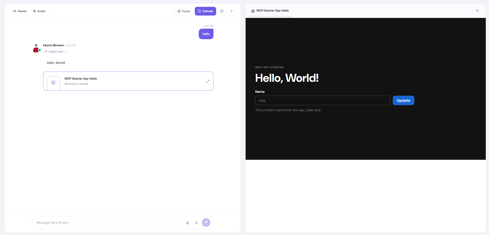
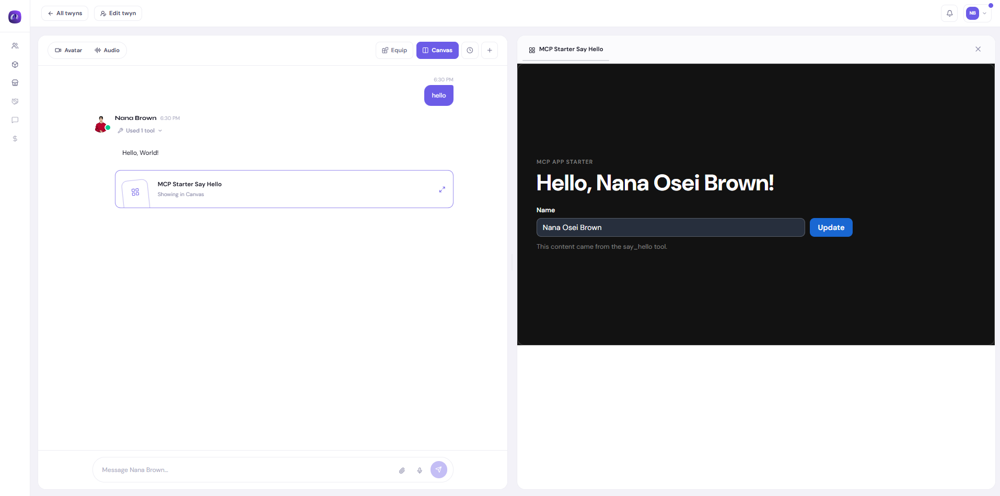

# Twynity FastMCP + MCP Apps starter template

A production-shaped starter for building a Python
[FastMCP](https://gofastmcp.com/) server with an embedded
[MCP App](https://modelcontextprotocol.io/extensions/apps/overview).

The template retains Twynity's authentication, licensing, usage reporting,
manifest and health routes, container setup, and deployment workflow. The
example feature is intentionally small: a `say_hello` tool renders
`Hello, <name>!` inside an interactive, client-themed React UI.

## Example output

Calling `say_hello` opens the MCP App in the client's available UI space:



The user can then enter a name and update the greeting directly from the App:



## Understand the tool-to-UI flow

An MCP App consists of a tool and a UI resource joined by the same `ui://` URI:

```text
Model calls say_hello
        |
        v
Tool returns content + structured_content
        |
        | AppConfig(resource_uri="ui://starter/hello.html")
        v
Client loads the matching ui:// resource
        |
        v
app.ontoolresult receives structuredContent and updates the UI
```

In this example:

- `app/tools/say_hello.py` contains the tool and declares
  `ui://starter/hello.html` in its `AppConfig`.
- `app/ui/say_hello/resource.py` registers that same URI and serves the
  compiled UI.
- `app/ui/say_hello/src/App.jsx` receives the result and reads
  `structuredContent.message`.
- `app/ui/say_hello/index.html` and `src/style.css` define what the user
  sees inside the MCP client.

The tool returns two forms of output:

- `content` is readable by the model and by clients without MCP Apps support.
- `structured_content` is the stable JSON contract consumed by the UI.

## 1. Configure the starter

Set `mcp_name` in `app/config.py`. It is deliberately empty and marked with a
`Put your MCP name here` comment. Until it is set, the application uses
`starter` as a runnable fallback.

Copy the environment example and replace its placeholder values:

```bash
cp .env.example .env
```

The production authentication, usage, and licensing integrations require
working service URLs and credentials.

## 2. Build a tool

Use `app/tools/say_hello.py` as the pattern. A useful LLM-facing tool docstring
should explain:

1. What the tool does.
2. When the model should use it.
3. Every argument and its expected meaning.
4. The return contract, especially fields exposed to the UI.
5. A short representative example.

Register the tool in `app/main.py`. Return a `ToolResult` when you need explicit
control over both model-readable content and UI-readable structured data:

```python
return ToolResult(
    content="A useful summary for the model",
    structured_content={"message": "Data for the UI"},
)
```

Treat `structured_content` as an API contract. If the Python field name changes,
update the UI that reads it and the tests that protect it.

## 3. Build the UI

Every UI-enabled tool gets a matching folder under `app/ui/`. For example,
`app/tools/say_hello.py` is paired with `app/ui/say_hello/`:

```text
app/ui/say_hello/
|-- resource.py      # Registers the ui:// resource
|-- index.html       # Document structure; your UI goes here
|-- src/App.jsx      # React UI, MCP hooks, and tool-result handling
|-- src/main.jsx     # React entry point
|-- src/style.css    # Client-aware presentation
|-- package.json
`-- vite.config.js
```

The example uses the official `@modelcontextprotocol/ext-apps/react` package.
`useApp` owns the App connection, `useHostStyleVariables` applies the client's
theme and CSS variables, `useHostFonts` installs client-provided font rules,
and `useDocumentTheme` exposes the active theme reactively. Always provide CSS
fallbacks because hosts may expose different subsets of styling information.
React escapes rendered string values by default; do not bypass that protection
with `dangerouslySetInnerHTML` for tool-provided content.

The name input is a controlled React field. Submitting the form calls
`say_hello` through `app.callServerTool`, then renders the returned
`structuredContent.message`. Tools called from their UI need `"app"` in their
`AppConfig.visibility`; this example uses `["model", "app"]` so both the model
and UI can call it.

The example also enables `useApp({ autoResize: true })`. Its document and root
styles provide a useful intrinsic minimum height and stretch to the host's
available iframe height, allowing the host to resize the App dynamically.

## 4. Link the tool and UI

Choose one stable URI and use it in both places:

```python
VIEW_URI = "ui://starter/hello.html"

@mcp.tool(app=AppConfig(resource_uri=VIEW_URI))
def your_tool(...):
    ...

@mcp.resource(VIEW_URI, app=AppConfig())
def your_view():
    ...
```

The MCP client discovers the URI in the tool metadata, reads the matching
resource, renders it in a sandboxed iframe, and forwards tool results to the
App SDK's `ontoolresult` handler.

Also repeat the URI in the returned `ToolResult.meta`:

```python
return ToolResult(
    content="A useful summary for the model",
    structured_content={"message": "Data for the UI"},
    meta={
        "ui": {"resourceUri": VIEW_URI},
        "ui/resourceUri": VIEW_URI,
    },
)
```

The nested value is the current MCP Apps representation and the flat value is
retained for compatibility. Twynity clients inspect this response metadata to
select the renderer immediately, avoiding an additional resource-discovery
round trip. Keep both values aligned with the URI registered by the resource.

## 5. Compile the UI

Generated frontend files are not committed. Install Node.js 20.19+ or 22.12+,
then compile the UI before running the server directly:

```bash
cd app/ui/say_hello
npm ci
npm run build
cd ../../..
```

This creates `app/ui/say_hello/dist/index.html`. Running the Python server
without it produces an error explaining which build commands are required.

For iterative UI work, rebuild after changes or use Vite directly. FastMCP also
provides an MCP Apps preview environment:

```bash
fastmcp dev apps app/main.py
```

## 6. Install and test the backend

Install [uv](https://docs.astral.sh/uv/getting-started/installation/), then sync
the locked runtime and development dependencies. uv creates and manages the
project's `.venv` automatically:

```bash
uv sync --locked
uv run pytest -q
uv run ruff check app tests
```

Add or remove Python packages with `uv add <package>` and development tools
with `uv add --dev <package>`. Commit both `pyproject.toml` and `uv.lock` so
local, CI, and container installs resolve to the same versions.

The complete test suite expects the UI compilation step to have run first so it
can verify the actual resource served to MCP clients.

## 7. Run locally

```bash
uv run uvicorn app.main:app --host 0.0.0.0 --port 8000
```

Available endpoints:

- MCP transport: `/mcp`
- Manifest: `/api/v1/.well-known/mcp.json`
- Health: `/api/v1/health`

The `/mcp` transport requires a bearer token issued by the configured account
service. The manifest and health endpoints remain public.

## 8. Compile and deploy with Docker

The Dockerfile is multi-stage. Its Node stage installs the locked UI
dependencies and compiles `dist/index.html`; its Python stage uses the uv
lockfile to install production dependencies and copies only the compiled UI
into the runtime image. A local build is:

```bash
docker build -t your-mcp:local .
docker run --rm --env-file .env -p 8000:8000 your-mcp:local
```

Before using the included GitHub workflows, replace:

- The `mcp-server-*` image repository names.
- The `your_mcp` key used to update the GitOps values file.
- Environment-specific domains or secrets required by your deployment.

The development, staging, and production workflows retain the Twynity build,
registry, and GitOps deployment sequence.

## Repository rules

- `uv.lock` and `app/ui/say_hello/package-lock.json` are generated dependency
  snapshots. Regenerate them with uv/npm commands instead of editing them.
- Do not commit `.env`, runtime logs, `node_modules`, Python bytecode, or
  `app/ui/*/dist`.
- Commit `uv.lock` so backend dependency resolution remains repeatable.
- Commit `package-lock.json` so UI dependency resolution remains repeatable.
- Rebuild the UI before local integration testing.
- Let the Docker build produce the deployable UI bundle for releases.
